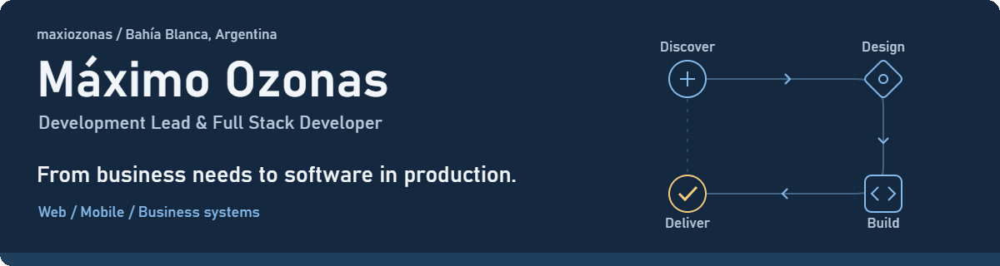

<picture>
  <source media="(prefers-reduced-motion: reduce) and (max-width: 600px)" srcset="./assets/profile-header-mobile.svg" />
  <source media="(prefers-reduced-motion: reduce)" srcset="./assets/profile-header.svg" />
  <source media="(max-width: 600px)" srcset="./assets/profile-header-mobile.gif" />
  
</picture>

  <a href="https://maxiozonas.github.io/es/">Portfolio</a> &nbsp; / &nbsp;
  <a href="https://linkedin.com/in/maximoozonas">LinkedIn</a> &nbsp; / &nbsp;
  <a href="mailto:maxiozonas10@gmail.com">Email</a> &nbsp; / &nbsp;
  <a href="./CV_Maximo_Ozonas_EN.pdf">Read my CV</a>

I build **web and mobile software for business operations**, combining full-stack development with technical leadership and project management. I work across requirements, architecture, implementation, deployment, and production maintenance.

## Experience

**Gili / Giliycia SRL · Development Lead** — Oct 2025–present 
Technical standards, architecture, and roadmap for internal business systems. I develop tools for order picking, logistics, freight settlement, B2B portals, showroom queues, ticketing, and catalog automation, with **Flexxus and Magento integrations**.

**Food Partners Patagonia S.A. · Full Stack Developer, via Xenova** — Sep 2025–present 
A cross-functional ERP for seafood processing: **production, quality, inventory, and traceability from port to export**, plus HR and an employee self-service PWA. Built with **Laravel, React, and TypeScript**.

Inside the ERP

- **Operations:** raw-material intake, weighing, processing, palletizing, orders, and container exports.
- **Traceability:** lots and pallets, cold-storage maps, inter-plant transfers, and foreign-trade documentation.
- **People:** personnel records, clock-ins, leave, approvals, PDF payslips, and internal communications.
- **Architecture:** REST API, separate apps by business area, granular permissions, per-plant database selection, and real-time error monitoring.

## Selected projects

Freelance work through **Xenova** — 2025–present

| Project | What I built |
| :--- | :--- |
| **Catalejo Travel** | Travel experiences catalog, seasonal pricing, CMS, and WhatsApp inquiries. |
| **Quinta Pata** | Pet healthcare enrollment, Excel imports, and verifiable QR membership credentials. |
| **Inspira Ingeniería** | Corporate website with secure project and content administration. |
| **Madryn Buceo** | Corporate website, reservations, and management backend, delivered using Scrum. |

## Toolkit

| Area | Technologies |
| :--- | :--- |
| **Web** | TypeScript, JavaScript, React, Next.js |
| **Backend & data** | PHP, Laravel, PostgreSQL, MySQL, REST APIs |
| **Mobile** | React Native, Expo, Flutter |
| **Infrastructure** | Linux, VPS, Docker, Docker Compose, CI/CD, Git, AWS |

More tools, education & languages

**Also work with:** Python, Java, C#, .NET, and Spring Boot. 
**AI coding tools:** Claude Code, Codex, and OpenCode.

**University Technical Degree in Programming** — Universidad Tecnológica Nacional (UTN), 2021–2024. 
**Languages:** Spanish (native) · English (B1, intermediate).

---

Have a business process that could work better with software? **[Let's talk](mailto:maxiozonas10@gmail.com).**
