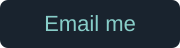
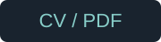

  <a href="./PROFILE.md" title="Read my full profile as text">
    <picture>
      <source media="(prefers-reduced-motion: reduce) and (max-width: 600px)" srcset="./assets/profile-dark-mobile.svg" />
      <source media="(prefers-reduced-motion: reduce)" srcset="./assets/profile-dark.svg" />
      <source media="(max-width: 600px)" srcset="./assets/profile-dark-mobile.gif" />
      
    </picture>
  </a>

  
  
  
  

